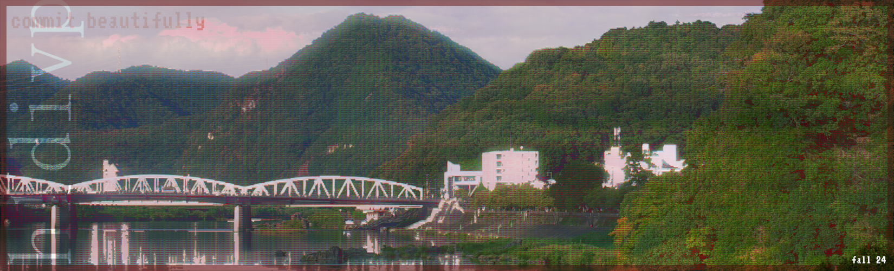

    

    <h3>Welcome to my profile. I'm Phoenix, or "h1divp"!</h3>
    I've worked on projects that deal with web, mobile, databases, and APIs. I want to build apps that allow for a lot of collaboration between people, plus points if it builds a cool community. 
    I originally taught myself how to program, but after taking university classes I enjoy regularly working with others more. I hope to write good and impactful software. I value simplicity. I love OSS.

    h1dividedbyp.bearblog.dev

   

    h1divpointer( at )pm.me

<h6>P.S.: You should make yourself a nice banner. I messed around in GIMP for mine, it's quite fun.</h6>
